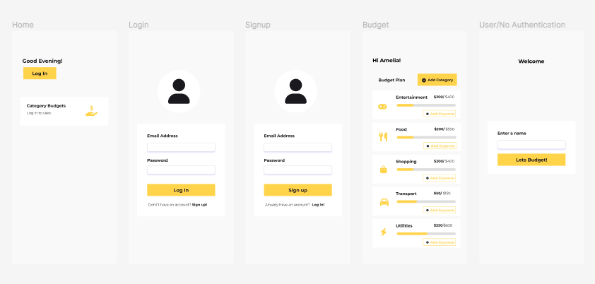

# Budget Tracker App (WIP)

## Aim

A hobby project based around creating a budget app, allowing the user to track their income and spending.

## Goal

-   To create a minimalistic and functional UI design
-   To familiarise myself with the concepts of TypeScript and Styled-Components
-   Including authentication => Optional

## Tech Stack Used

-   ReactJS
-   TypeScript
-   Styled Components
-   React Router DOM
-   Figma

## User Interface Design

Before writing any code, I decided to come up with the app design, as an outline and indicator of the number of screens and components/features needed.

**Here is a link to the figma design of the app:**

https://www.figma.com/file/soJq5gKdBy1h8OMoH2UXeo/Budget-App?node-id=0%3A1

### Figma Screenshot

### Future Implementations

-   Dark-Mode Design
